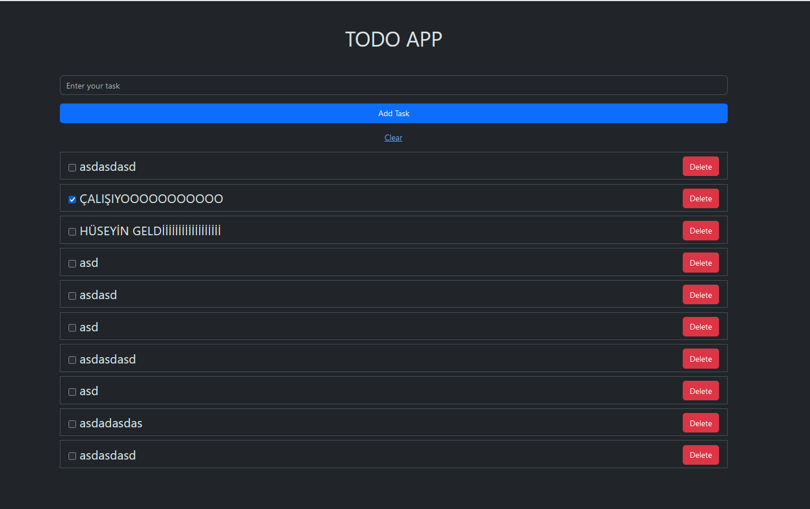

# PHP Todo App

Speed run TODO APP with PHP

Works with sessions. So you will not be able to see the same todo list in different browsers.

## How to run

Before you run the command, make sure you have docker and docker-compose installed.

```bash
docker-compose up -d
```

## Preview



## License

[MIT](https://choosealicense.com/licenses/mit/)